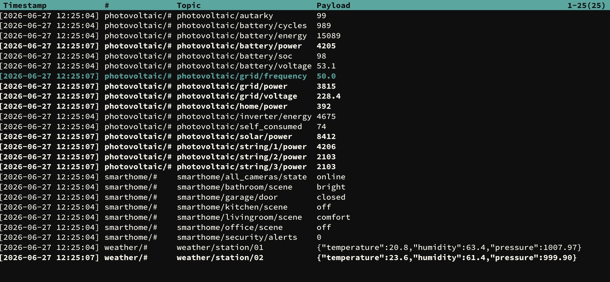

# submqtt
[](https://github.com/pvtom/submqtt/)
[](https://github.com/pvtom/submqtt/commits)
[](https://github.com/pvtom/submqtt/issues)
[](https://github.com/pvtom/submqtt/pulls)
[](https://github.com/pvtom/submqtt/blob/main/LICENSE)



submqtt is a command-line tool that acts as an MQTT client and displays MQTT data in a table format.
You can subscribe to multiple topics. Topics, payloads and timestamps can be filtered.

New and changed topics are highlighted in color.

## Docker

A Docker image is available at https://hub.docker.com/r/pvtom/submqtt

Start submqtt as a Docker container using this command:

```
docker run --rm -it -e TZ=Europe/Berlin -e MQTT_HOST=your_mqtt_broker pvtom/submqtt:latest
```

For an overview of the available parameters (-e), visit this [page](DOCKER.md).

## Interactive Controls

The program can be controlled using the keyboard. The following commands are available.

| Key | Command |
| --- | --- |
| Esc, 'c' | Reset shifted or moved payloads |
| Crtl-c, 'q' | Quit |
| 'i', '!' | Info page |
| 'h', '?' | Help |
| 't' | Switch timestamp format |
| 's' | Show / hide matching subscriptions |
| 'x' | Switch heat mode on / off |
| Up / down | Scroll up / down |
| Mouse Up / down | Scroll up / down |
| Right / left | Move payloads right / left |
| F1 / F2 / Home / End | Jump to the top / end of the list |
| F3 / F4 / Page up / down | Page up / down |
| F5 / F6 / Shift right / left | Shift payloads (only if payloads don't fit on the line) |
| F7 / F8 | Switch color schemes |
| F9 | Underline highlighted payloads |
| '/', Crtl-f | Search mode. Enter topics to be highlighted |
| Crtl-d | Clear search string |
| 'n' | Jump to the next highlighted topic |

You can also scroll using the mouse.

Hint: There may be some limitations, depending on your environment.

## Local Installation

To install the tool locally, please read these [instructions](INSTALL.md).

## External Libraries
- Eclipse Mosquitto (https://github.com/eclipse/mosquitto)
- Ncurses (https://invisible-island.net/ncurses)
